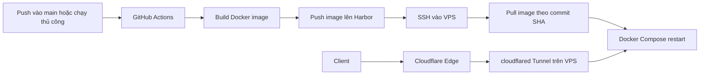
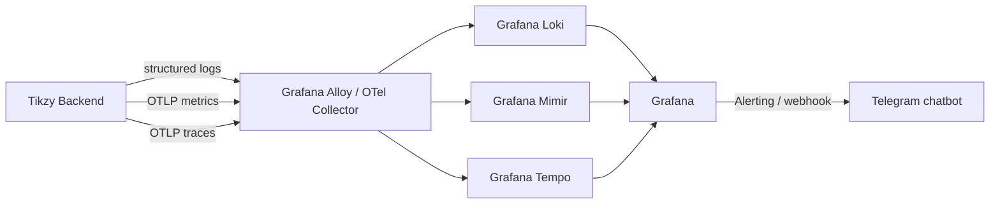

# Tikzy

Nền tảng bán vé sự kiện trực tuyến theo mô hình **Marketplace**, kết nối **Nhà tổ chức sự kiện (BTC)** với **Người mua vé**.

## Tech Stack

Các công nghệ chính đang được sử dụng trong hệ thống:

### Application

<p align="center">
  <a href="https://www.java.com/"></a>
  <a href="https://spring.io/projects/spring-boot"></a>
  <a href="https://spring.io/projects/spring-security"></a>
  <a href="https://maven.apache.org/"></a>
  <a href="https://mapstruct.org/"></a>
</p>

### Frontend

<p align="center">
  <a href="https://react.dev/"></a>
  <a href="https://vite.dev/"></a>
  <a href="https://www.typescriptlang.org/"></a>
</p>

### Data & Infrastructure

<p align="center">
  <a href="https://www.postgresql.org/"></a>
  <a href="https://supabase.com/"></a>
  <a href="https://redis.io/"></a>
  <a href="https://documentation.red-gate.com/flyway"></a>
  <a href="https://www.docker.com/"></a>
</p>

### Security & Integrations

<p align="center">
  <a href="https://jwt.io/"></a>
  <a href="https://cloudinary.com/"></a>
  <a href="https://github.com/zxing/zxing"></a>
  <a href="https://www.brevo.com/"></a>
</p>

### Delivery & Observability

<p align="center">
  <a href="https://github.com/features/actions"></a>
  <a href="https://goharbor.io/"></a>
  <a href="https://developers.cloudflare.com/cloudflare-one/connections/connect-networks/"></a>
  <a href="https://grafana.com/"></a>
  <a href="https://grafana.com/oss/loki/"></a>
  <a href="https://grafana.com/oss/mimir/"></a>
  <a href="https://grafana.com/oss/tempo/"></a>
  <a href="https://opentelemetry.io/"></a>
  <a href="https://core.telegram.org/bots"></a>
</p>

> Repository hiện tại tập trung vào backend Spring Boot trong thư mục `backend/`; các badge frontend phản ánh kiến trúc SPA được sử dụng cho Tikzy.

## Tổng quan kỹ thuật

| Hạng mục | Quyết định |
|----------|-----------|
| Kiến trúc | Modular Monolith (1 Spring Boot app) |
| Backend | Java 21 / Spring Boot 3.5.5 |
| Frontend | React 18 + Vite + TypeScript (SPA) |
| Database | Supabase (managed PostgreSQL) — PgBouncer port 6543 |
| Cache / Lock | Redis (cache, session, distributed lock chống oversell) |
| Image Storage | Cloudinary |
| Dòng tiền | **Escrow** — 100% tiền vé giữ tại Tikzy, quyết toán cho BTC sau show |
| Payment | **Strategy Pattern** + **Auto-Refund API** (VNPAY, MoMo) |
| CI/CD | GitHub Actions → Docker Buildx → Harbor → SSH deploy lên VPS |
| Deploy | VPS + Docker Compose; public ingress qua Cloudflare Tunnel (`cloudflared`) |
| Observability | Grafana + Loki (logs) + Mimir (metrics) + Tempo (traces) |
| Alerting | Grafana Alerting → Telegram chatbot |

## CI/CD và triển khai production

### Luồng phát hành



Workflow hiện tại nằm tại [`.github/workflows/ci-cd.yml`](./.github/workflows/ci-cd.yml) và thực hiện:

1. Chạy khi có `push` vào nhánh `main` hoặc khi được kích hoạt bằng `workflow_dispatch`.
2. Build image từ `backend/Dockerfile` bằng Docker Buildx.
3. Push image lên Harbor với hai tag: `latest` và `${GITHUB_SHA}`.
4. SSH vào VPS bằng user `tikzy`, cập nhật source tại `/projects/tikzy` và đăng nhập Harbor.
5. Pull đúng image theo commit SHA rồi chạy `docker compose up -d --remove-orphans`.

Các GitHub Actions secrets bắt buộc:

| Secret | Mục đích |
|--------|----------|
| `HARBOR_USERNAME` | Tài khoản đọc/ghi image trên Harbor |
| `HARBOR_PASSWORD` | Mật khẩu hoặc robot token của Harbor |
| `SERVER_HOST` | Hostname/IP của VPS |
| `SERVER_SSH_KEY` | Private key dùng để deploy |
| `SERVER_FINGERPRINT` | SSH host fingerprint để chống kết nối nhầm máy |

> Workflow hiện tại là pipeline build và deploy. Dockerfile đang dùng `-DskipTests`, vì vậy unit test, integration test, lint và migration check chưa phải quality gate bắt buộc của CI. Có thể bổ sung các bước này trước job `build-image` khi bộ kiểm thử sẵn sàng.

### Chuẩn bị VPS

VPS production cần có Docker Engine, Docker Compose plugin, Git và `cloudflared`. User deploy nên chạy không cần root và chỉ có quyền cần thiết cho Docker/deploy.

```text
/projects/tikzy/
├── .env                 # secret production, không commit
├── docker-compose.yml   # backend + Redis
└── backend/             # source dùng để đồng bộ theo workflow
```

Khởi tạo lần đầu trên VPS:

```bash
git clone https://github.com/HaoHV2k5/tikzy.git /projects/tikzy
cd /projects/tikzy
cp backend/.env.example .env
# Điền secret production vào .env trên VPS, không đưa file này lên Git.
docker compose config
docker compose up -d
docker compose ps
```

`docker-compose.yml` chạy backend từ image Harbor và Redis có volume persistence. PostgreSQL production dùng Supabase managed; các biến `SUPABASE_*`, JWT, Cloudinary, Brevo và `REDIS_PASSWORD` phải có trong `.env` trước khi start.

### Rollback

Image được tag theo commit SHA để rollback không phụ thuộc vào tag `latest`:

```bash
cd /projects/tikzy
IMAGE_TAG=<known-good-commit-sha> docker compose pull
IMAGE_TAG=<known-good-commit-sha> docker compose up -d --remove-orphans
docker compose ps
```

Sau mỗi lần deploy cần kiểm tra container, log backend, kết nối Redis và smoke test API qua domain production.

## Cloudflare Tunnel và public ingress

`cloudflared` tạo kết nối outbound từ VPS lên Cloudflare. Vì vậy API không cần mở port inbound trực tiếp trên Internet; Cloudflare xử lý DNS, TLS và chuyển tiếp request qua tunnel đến backend local.

```text
Client
  │ HTTPS
  ▼
Cloudflare DNS / Edge
  │ Cloudflare Tunnel
  ▼
cloudflared trên VPS
  │ http://127.0.0.1:8080
  ▼
Tikzy backend container
```

Ví dụ cấu hình `/etc/cloudflared/config.yml`:

```yaml
tunnel: <TUNNEL_UUID>
credentials-file: /etc/cloudflared/<TUNNEL_UUID>.json

ingress:
  - hostname: api.example.com
    service: http://127.0.0.1:8080
  - hostname: grafana.example.com
    service: http://127.0.0.1:3000
  - service: http_status:404
```

Tạo tunnel và cài service systemd:

```bash
cloudflared tunnel login
cloudflared tunnel create tikzy-prod
cloudflared tunnel route dns tikzy-prod api.example.com
sudo mkdir -p /etc/cloudflared
sudo cp ~/.cloudflared/<TUNNEL_UUID>.json /etc/cloudflared/
sudo cloudflared tunnel ingress validate --config /etc/cloudflared/config.yml
sudo cloudflared service install
sudo systemctl enable --now cloudflared
sudo systemctl status cloudflared
```

Khuyến nghị vận hành:

- Chỉ publish backend qua Cloudflare Tunnel; không expose trực tiếp port của Loki, Mimir, Tempo hoặc Redis.
- Nếu vẫn dùng port mapping hiện tại, giới hạn port `8080` bằng firewall hoặc bind host port vào loopback; Cloudflare Access nên bảo vệ `grafana.example.com`.
- Chỉ mở SSH `22/tcp` từ IP quản trị. Không đưa tunnel credentials, API token hoặc `.env` vào repository.
- Production nên bật `JWT_REFRESH_COOKIE_SECURE=true`, cấu hình CORS theo domain thật và kiểm tra HTTPS end-to-end.

> Repo hiện có workflow và Docker Compose cho build/deploy. File `cloudflared` chưa được commit trong repository; cấu hình tunnel, DNS và firewall cần được quản lý trên VPS/Cloudflare Zero Trust.

## Monitoring, logging và tracing

### Kiến trúc observability



| Tín hiệu | Nguồn thu thập | Backend lưu trữ | Mục đích |
|----------|----------------|-----------------|----------|
| Logs | stdout JSON của container, thu qua Alloy | Loki | Điều tra lỗi, audit và tìm theo `trace_id`/`request_id` |
| Metrics | Spring Boot Actuator/Micrometer hoặc OpenTelemetry | Mimir | Uptime, throughput, error rate, latency, JVM và Redis |
| Traces | OpenTelemetry Java agent/SDK qua OTLP | Tempo | Theo dõi request xuyên suốt controller, DB, Redis và payment |
| Dashboards | Datasource Loki/Mimir/Tempo | Grafana | Dashboard vận hành và liên kết logs-metrics-traces |
| Alerts | Grafana Alerting | Telegram chatbot | Cảnh báo realtime cho on-call |

Các nhãn dùng chung nên có cardinality thấp: `service=tikzy-backend`, `environment=production`, `instance=<vps>`, `level`. Không dùng `user_id`, email, order ID hoặc trace ID làm label Loki/Mimir; các giá trị này nên nằm trong nội dung log hoặc field của trace.

### Logging và correlation

Backend nên ghi log dạng structured JSON ra stdout để Docker/Alloy thu thập. Mỗi request và tác vụ payment/refund cần mang `request_id` hoặc `trace_id` xuyên suốt log, response và trace. Không ghi JWT, mật khẩu, refresh token, payment secret hoặc dữ liệu cá nhân nhạy cảm vào log.

Ví dụ truy vấn Loki sau khi pipeline JSON được bật:

```logql
{service="tikzy-backend", environment="production"} | json | level="ERROR"
{service="tikzy-backend", environment="production"} |= "payment"
```

### Metrics và tracing

- Expose health/metrics nội bộ qua Spring Boot Actuator; chỉ cho phép mạng monitoring truy cập, không public endpoint quản trị.
- Gửi metrics đến Mimir bằng remote write hoặc OTLP qua Alloy/OTel Collector.
- Gửi traces đến Tempo bằng OTLP; truyền `traceparent` giữa các service/provider khi có hỗ trợ.
- Dashboard tối thiểu cần có request rate, 4xx/5xx, p95/p99 latency, JVM heap/GC, connection pool, Redis health, payment callback, refund failure và container restart.

Các alert nên cấu hình trong Grafana:

| Alert | Điều kiện gợi ý | Kênh |
|-------|-----------------|------|
| Backend down | Target không scrape được trong 2-5 phút | Telegram |
| HTTP 5xx tăng | Error rate vượt ngưỡng trong 5 phút | Telegram |
| Latency cao | p95/p99 vượt SLO trong 10 phút | Telegram |
| Redis hoặc DB lỗi | Health check/connection error liên tục | Telegram |
| Payment/refund lỗi | Tỷ lệ callback thất bại hoặc pending tăng | Telegram |
| VPS bất thường | Disk, memory, CPU hoặc container restart vượt ngưỡng | Telegram |

### Telegram chatbot

1. Tạo bot bằng `@BotFather` và lấy `TELEGRAM_BOT_TOKEN`.
2. Lấy `TELEGRAM_CHAT_ID` của nhóm on-call, sau đó cấu hình Telegram Contact Point trong Grafana hoặc webhook adapter nội bộ.
3. Tạo notification policy theo mức độ `critical`, `warning` và route alert của production vào nhóm vận hành.
4. Test bằng một alert giả lập; kiểm tra message có service, environment, severity, dashboard URL và thời điểm xảy ra.

Token và chat ID chỉ lưu trong secret store/Grafana provisioning secret trên VPS. Không hard-code trong README, workflow, Docker image hoặc log.

> Trạng thái repository: workflow deploy và container runtime đã có; cấu hình Grafana, Loki, Mimir, Tempo, Alloy/OpenTelemetry và Telegram chưa được commit trong repo này. Phần trên là chuẩn tích hợp và runbook cần áp dụng khi dựng observability stack trên VPS.

## Các nhóm người dùng

- **Khách hàng**: tìm sự kiện, mua vé, áp voucher, thanh toán, nhận vé QR, check-in, hoàn vé/hoàn tiền tự động.
- **Nhà tổ chức (BTC)**: tạo sự kiện & hạng vé, cấp voucher, cấu hình chính sách hoàn vé, quét vé check-in, broadcast thư xin lỗi + voucher đền bù.
- **Admin Tikzy**: duyệt sự kiện, giám sát Escrow, hủy show & chạy hoàn tiền hàng loạt, duyệt quyết toán cho BTC.

## Quy trình nghiệp vụ chính

1. **Mua vé & Voucher**: chọn suất/hạng vé → áp voucher (nếu có) → tính `total_amount` thực trả → thanh toán → phát hành vé QR.
2. **Escrow & Quyết toán**: tiền vé giữ tại Tikzy trong suốt thời gian mở bán → sau show, BTC gửi yêu cầu quyết toán → Admin duyệt → chuyển phần tiền thực nhận (trừ phí nền tảng & phí quảng cáo trả sau).
3. **Hủy show & Auto-Refund**: Admin kích hoạt → hệ thống batch hoàn tiền tự động qua Refund API **đúng `total_amount` thực trả**; voucher không quy đổi tiền mặt.
4. **Hoàn vé theo policy của BTC**: kiểm tra deadline → tính tiền hoàn (trừ phí phạt %) → gọi `PaymentStrategy.refund()`.
5. **Bồi thường voucher**: công cụ trên Organizer Dashboard cho BTC gửi thư xin lỗi + voucher đền bù đến khách từng dùng voucher.

## Module nghiệp vụ

- **Event**: CRUD sự kiện, suất diễn, hạng vé, chính sách hoàn vé (`NO_REFUND` / `ALLOW_REFUND`), upload ảnh Cloudinary.
- **Ticket & Inventory**: nhiều hạng vé (Early Bird, GA, VIP...), mỗi order gắn một suất diễn, inventory theo `show_time + ticket_type`, giữ chỗ 15 phút bằng Redis `SETNX`, vé độc lập với QR ký số HMAC-SHA256 được Backend verify online.
- **Promotion**: voucher theo % hoặc số tiền cố định, giới hạn lượt dùng tổng và theo user, ví voucher, lịch sử sử dụng và voucher đền bù.
- **Payment (Strategy)**: đa cổng thanh toán + Auto-Refund đảo ngược giao dịch, callback idempotent, chỉ hoàn `orders.total_amount`.
- **Settlement**: chốt sổ doanh thu sau show, tính phí dịch vụ, xuất biên bản đối soát (PDF/Excel).
- **Check-in**: quét QR (`html5-qrcode`), Backend verify online, chống double check-in bằng DB Unique Constraint.
- **Banner**: slider trang chủ, banner danh mục, lên lịch hiển thị + ưu tiên.
- **Auth & Session**: JWT (Access 15-30p) + Refresh Token (lưu DB), Logout thu hồi, Refresh Token Rotation.

### Chính sách khóa tài khoản

- Admin cấu hình số lần đăng nhập sai tối đa qua `GET/PATCH /api/v1/admin/security-policy` với trường `maxFailedLoginAttempts` (mặc định `5`).
- Mỗi lần nhập sai mật khẩu làm tăng bộ đếm. Khi đạt ngưỡng, tài khoản bị khóa, toàn bộ session bị thu hồi và access token cũ không còn hợp lệ. Đăng nhập thành công sẽ reset bộ đếm.
- Người dùng gửi email qua `POST /api/v1/auth/account-unlock/request`. Hệ thống chỉ gửi OTP đến email của tài khoản đang bị khóa và luôn trả thông báo chung để tránh lộ thông tin tài khoản.
- Người dùng gửi email và OTP qua `POST /api/v1/auth/account-unlock/verify-otp`. Chỉ OTP hợp lệ mới nhận được reset token dùng một lần.
- Người dùng gửi reset token, `newPassword` và `confirmPassword` qua `POST /api/v1/auth/account-unlock/reset-password`. Thành công mới mở khóa tài khoản, reset bộ đếm và thu hồi session cũ.

### Quên mật khẩu

- Người dùng gửi email qua `POST /api/v1/auth/password-reset/request`. Hệ thống chỉ gửi OTP cho tài khoản đang hoạt động và luôn trả thông báo chung để tránh lộ thông tin tài khoản.
- Người dùng gửi email và OTP qua `POST /api/v1/auth/password-reset/verify-otp`. OTP hợp lệ trả về reset token dùng một lần.
- Người dùng gửi reset token, `newPassword` và `confirmPassword` qua `POST /api/v1/auth/password-reset/reset-password`. Sau khi đổi mật khẩu, toàn bộ session cũ bị thu hồi.

## Quản trị rủi ro traffic cao

| Rủi ro | Giải pháp |
|--------|-----------|
| Overselling | 3 lớp: Redis `SETNX` + DB Update có điều kiện + Postgres `CHECK` constraint |
| Coupon abuse | Redis atomic `DECR` kiểm soát quota voucher |
| Cạn kiệt DB connection | PgBouncer pooler (port 6543) + HikariCP `maximum-pool-size: 15` |
| Batch refund nghẽn | Spring Batch / Redis Queue, chunk 30-50 đơn, nghỉ 200ms giữa request |
| Duplicate payment/refund | Unique transaction theo provider, conditional state update, Idempotency Key cho refund và query/retry cùng key |
| Mất callback thanh toán | Payment Reconciliation Scheduler quét đơn `PENDING` quá 15 phút |

## Cơ sở dữ liệu

Toàn bộ bảng dùng **UUID** làm khóa chính (`gen_random_uuid()`) — tránh lộ thông tin kinh doanh, dễ scale đa vùng, tương thích Hibernate 6+.

Các bảng chính: `roles`, `users`, `refresh_tokens`, `security_policies`, `account_unlock_requests`, `categories`, `events`, `show_times`, `ticket_types`, `show_time_ticket_inventories`, `tickets`, `promotions`, `user_promotions`, `promotion_usages`, `orders`, `order_items`, `payments`, `refund_logs`, `event_broadcasts`, `settlements`, `check_ins`, `ad_packages`, `ad_campaigns`, `banners`.

---

> Chi tiết đầy đủ: xem [`analysis_results.md`](./analysis_results.md).
