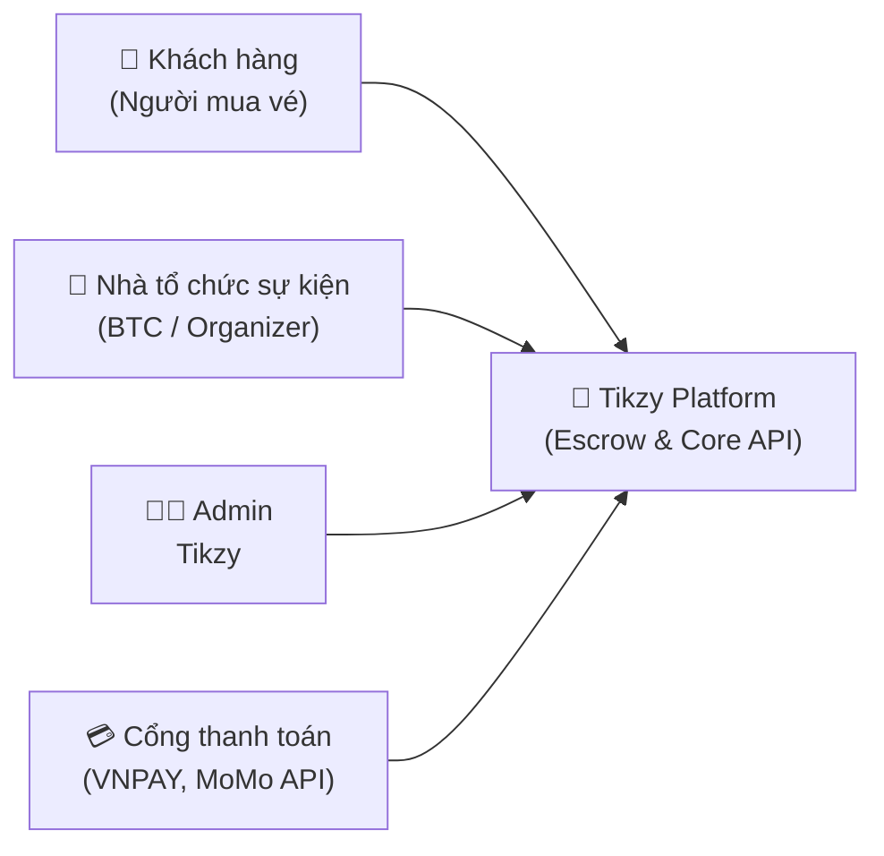
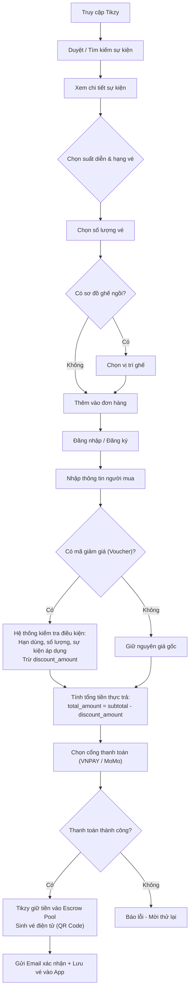
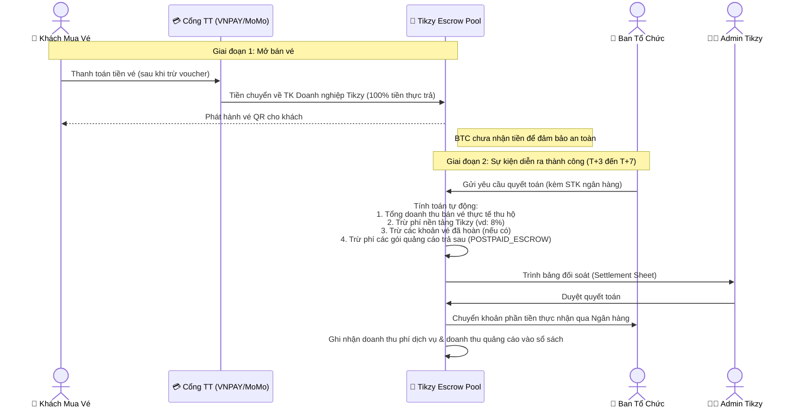
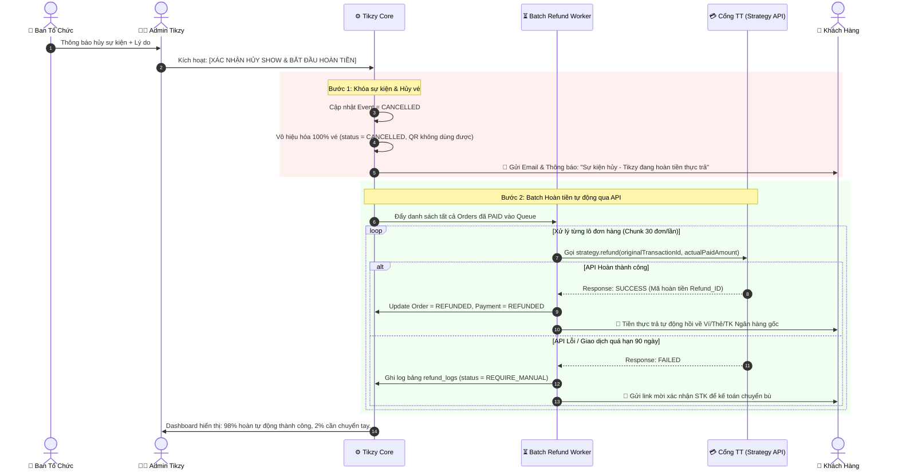
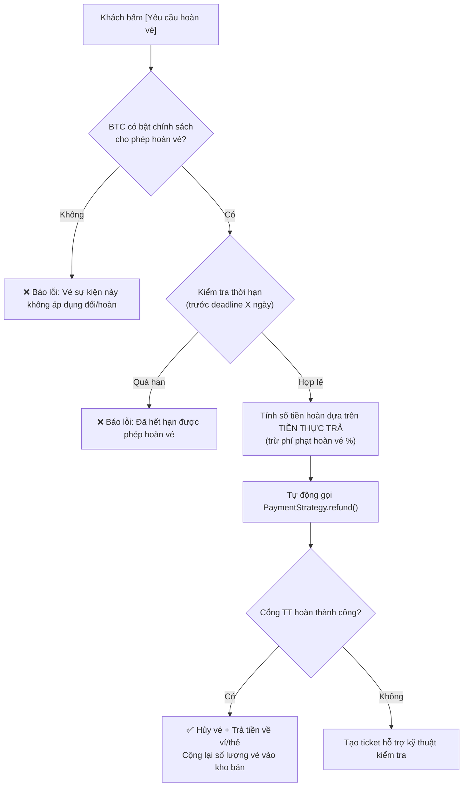
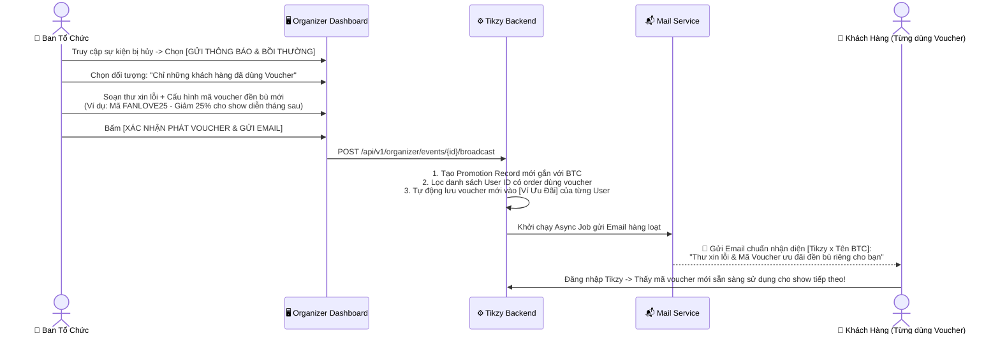
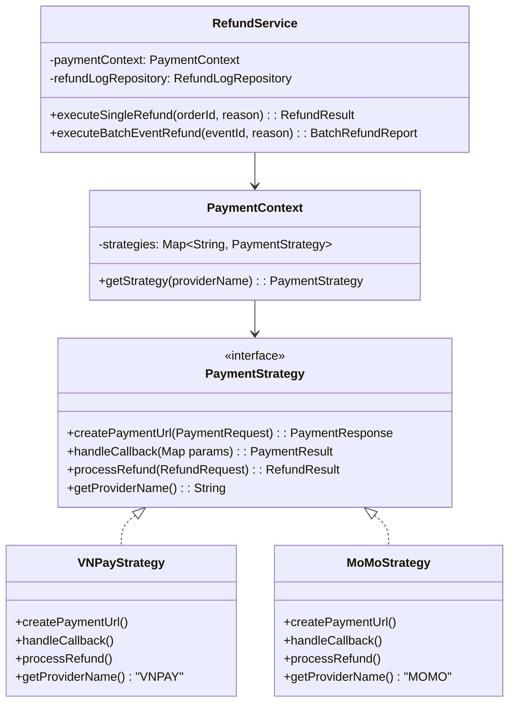

# Tikzy — Phân Tích Nghiệp Vụ & Thiết Kế Hệ Thống (Bản Toàn Diện)

## 1. Tổng Quan Dự Án

**Tikzy** là nền tảng bán vé sự kiện trực tuyến, hoạt động theo mô hình Marketplace kết nối **Nhà tổ chức sự kiện (BTC)** với **Người mua vé (Khách hàng)**.

### Quyết định kỹ thuật & Nghiệp vụ cốt lõi

| Hạng mục | Quyết định | Ghi chú |
|----------|-----------|---------|
| **Kiến trúc** | Modular Monolith (1 Spring Boot app) | Chạy 1 service duy nhất, phân chia package rõ ràng |
| **Backend** | Java 17+ / Spring Boot 3.x | Spring Security, Spring Data JPA, Spring Batch/Async |
| **Frontend** | React 18 + Vite + TypeScript | Giao diện Single Page Application (SPA) |
| **Database** | **Supabase** (managed PostgreSQL) | Kết nối qua HikariCP + PgBouncer (Port 6543) |
| **Cache / Lock** | Redis | Cache hot data, Session, Distributed Lock chống oversell |
| **Image Storage** | **Cloudinary** | Lưu banner, thumbnail, poster sự kiện |
| **Mô hình Dòng tiền** | **Escrow (Ký quỹ / Giữ hộ)** | 100% tiền vé đổ về TK Tikzy, quyết toán cho BTC sau sự kiện |
| **Payment Pattern** | **Strategy Design Pattern** | Hỗ trợ thanh toán và **Auto-Refund API** (VNPAY, MoMo...) |
| **Chính sách Voucher khi Hủy** | **Chỉ hoàn Tiền Thực Trả** | Voucher không quy đổi ra tiền mặt. Tikzy hỗ trợ công cụ để BTC cấp mã đền bù |
| **Order Design** | 2 bảng: Order + OrderItems | Khách có thể mua nhiều hạng vé trong 1 đơn |
| **Deploy** | VPS + Docker (Backend + Redis) | Dễ quản trị, chi phí tối ưu cho giai đoạn đầu |

---

## 2. Các Nhóm Người Dùng (Actors)

| Actor | Vai trò & Trách nhiệm |
|-------|-----------------------|
| **Khách hàng** | Tìm kiếm sự kiện, chọn vé, áp dụng voucher, thanh toán, nhận vé QR điện tử, check-in, yêu cầu hoàn vé hoặc nhận hoàn tiền tự động + nhận voucher đền bù từ BTC khi show hủy. |
| **Nhà tổ chức (BTC)** | Tạo sự kiện, cấu hình loại vé & voucher, thiết lập chính sách hoàn vé, quét vé check-in tại cổng, sử dụng công cụ Broadcast để gửi thư xin lỗi & phát voucher đền bù cho khách, nhận tiền quyết toán sau show. |
| **Admin Tikzy** | Duyệt sự kiện, giám sát dòng tiền Escrow, thực thi lệnh hủy show/hoàn tiền hàng loạt, duyệt đối soát quyết toán cho BTC. |
| **Cổng thanh toán** | Cung cấp kênh thu tiền (Pay URL) và kênh hoàn tiền tự động (Refund API). |

---

## 3. Quy Trình Nghiệp Vụ Chính

### 3.1. Quy Trình Mua Vé & Áp Dụng Voucher (Khách hàng)

---

### 3.2. Quy Trình Dòng Tiền Escrow & Quyết Toán Cho BTC (Settlement)

> [!IMPORTANT]
> **Nguyên tắc Escrow**: Toàn bộ tiền bán vé được **giữ an toàn tại tài khoản của Tikzy** trong suốt thời gian mở bán cho đến khi sự kiện kết thúc thành công.

---

### 3.3. Quy Trình Hủy Show & Hoàn Tiền Tự Động (Auto-Refund Gateway)

> [!CAUTION]
> **Nguyên tắc xử lý khi khách có áp dụng Voucher:**
> * **Chỉ hoàn lại đúng Tiền Thực Trả (`orders.total_amount`)**: Ví dụ vé 1.000.000đ, voucher giảm 200.000đ, khách trả 800.000đ → Hệ thống gọi API hoàn **đúng 800.000đ**.
> * **Voucher KHÔNG quy đổi thành tiền mặt**: BTC và Tikzy không trả 200.000đ tiền mặt cho khách. Thay vào đó, BTC sẽ dùng công cụ bồi thường ở Mục 3.5.

---

### 3.4. Quy Trình Khách Hàng Tự Yêu Cầu Hoàn Vé (Theo Policy của BTC)

---

### 3.5. Quy Trình Hỗ Trợ BTC Bồi Thường Voucher (Organizer Broadcast & Compensation Tool)

Sau khi show bị hủy và Tikzy đã hoàn tiền thực trả, những khách hàng từng áp dụng voucher có thể cảm thấy hụt hẫng vì mất quyền lợi giảm giá. 

**Tikzy giải quyết bài toán này bằng cách cung cấp công cụ Broadcast trực tiếp trên Organizer Center** để BTC chủ động chăm sóc và phát voucher đền bù:

---

## 4. Các Module Nghiệp Vụ Chi Tiết

### 4.1. Module Quản Lý Sự Kiện & Suất Diễn (Event Module)
* CRUD thông tin sự kiện, danh mục (Âm nhạc, Kịch, Thể thao, Hội thảo...).
* Upload và quản lý ảnh chất lượng cao qua **Cloudinary**.
* Cấu hình chính sách hoàn vé riêng cho từng show:
  * `NO_REFUND`: Không cho hoàn.
  * `ALLOW_REFUND`: Cho hoàn trước ngày diễn ra $N$ ngày, chịu phí phạt $X\%$.
* **Công cụ Organizer Broadcast**: Hỗ trợ BTC gửi thông báo cập nhật, thư xin lỗi và gửi tặng voucher đền bù trực tiếp trên nền tảng mà không lo lộ database khách hàng.

### 4.2. Module Vé & Giữ Chỗ (Ticket & Inventory Module)
* Phân chia nhiều hạng vé: Early Bird, GA, VIP, VVIP...
* Giữ chỗ tạm thời trong **15 phút** bằng **Redis Distributed Lock** (`SETNX`). Trong thời gian 15 phút này, khách hàng có thể thử thanh toán lại nhiều lần hoặc đổi cổng thanh toán (`orders 1 - N payments`) nếu gặp sự cố thanh toán.
* Tự động hoàn trả vé về kho nếu hết 15 phút chưa thanh toán qua `OrderExpirationScheduler`.
* **Phát hành vé độc lập & Mã QR Ký Số**:
  * Mỗi vé trong đơn hàng là 1 bản ghi riêng biệt với 1 mã QR độc lập (mua 4 vé = 4 mã QR riêng), cho phép đi riêng cổng hoặc chia sẻ vé cho bạn bè.
  * Mã QR chứa **Payload Ký Số bảo mật (HMAC-SHA256)** mã hóa đầy đủ thông tin: `ticketId`, `eventId`, `ticketType`, `seatNumber`, `customerName` và chữ ký số chống giả mạo vé, hỗ trợ máy quét đọc thông tin offline ngay cả khi mất mạng.

### 4.3. Module Khuyến Mãi & Voucher (Promotion Module)
* Hỗ trợ tạo mã giảm giá theo tỷ lệ phần trăm (%) hoặc số tiền cố định (VNĐ).
* Giới hạn lượt sử dụng tổng và lượt dùng tối đa trên mỗi tài khoản người dùng.
* Hỗ trợ **Voucher Bồi Thường (Compensation Voucher)** dành riêng cho nhóm khách hàng bị ảnh hưởng khi show hủy.

### 4.4. Module Thanh Toán & Hoàn Tiền (Payment Module - Strategy Pattern)
* Tích hợp đa cổng thanh toán qua cấu trúc **Strategy Pattern** chuẩn mở rộng.
* **Auto-Refund Service**: Tích hợp API hoàn tiền đảo ngược giao dịch của VNPAY, MoMo.
* **Escrow Management**: Theo dõi số dư tiền thu hộ của từng sự kiện.
* Đảm bảo tính toán chính xác: Chỉ hoàn tiền dựa trên `orders.total_amount` (số tiền thực tế người mua bị trừ).

### 4.5. Module Đối Soát & Quyết Toán (Settlement Module)
* Tự động chốt sổ doanh thu sau khi sự kiện kết thúc.
* Tính toán phí dịch vụ nền tảng (Platform Commission) theo hợp đồng.
* Xuất file biên bản đối soát tài chính (PDF/Excel) có chữ ký số hoặc xác nhận online.
* Lưu lịch sử giao dịch chuyển khoản quyết toán cho BTC.

### 4.6. Module Soát Vé Tại Cổng (Check-in Module)
* Web App & Mobile Web quét mã QR bằng camera (dùng thư viện `html5-qrcode`).
* Kiểm tra tính hợp lệ: Đúng sự kiện, đúng suất diễn, chưa từng check-in.
* Chặn Double Check-in bằng Database Unique Constraint + Atomic Update.
* Báo cáo tiến độ khách vào cổng theo thời gian thực (Real-time count).

### 4.7. Module Quản Lý Banner & Quảng Bá (Banner Module)
* Quản lý banner dạng Slider ở trang chủ (Hero Slider) hoặc các banner phụ ở danh mục sự kiện.
* Upload ảnh kích thước chuẩn qua **Cloudinary**.
* Thiết lập thời gian hiển thị (`start_date`, `end_date`), thứ tự ưu tiên (`sort_order`) và công tắc bật/tắt (`is_active`).
* Hỗ trợ gán liên kết trực tiếp tới chi tiết sự kiện (`event_id`) hoặc URL ngoài (`target_url`).

### 4.8. Module Xác Thực & Quản Lý Phiên (Auth & Session Module)
* **Cặp Token (Access Token & Refresh Token)**:
  * Access Token (JWT): Hạn ngắn (15 - 30 phút), dùng để gọi API xác thực.
  * Refresh Token: Hạn dài (7 - 30 ngày), lưu trong DB bảng `refresh_tokens`.
* **Cơ chế Logout & Thu hồi (Revocation)**:
  * Khi user bấm Đăng xuất: Hệ thống đánh dấu `is_revoked = true` cho Refresh Token đó. Token không thể tái sử dụng để lấy Access Token mới.
  * Hỗ trợ tính năng "Đăng xuất khỏi tất cả thiết bị" (Revoke all sessions của User).
* **Refresh Token Rotation**: Mỗi lần đổi token mới, Refresh Token cũ bị vô hiệu hóa và cấp 1 Refresh Token mới để phòng chống đánh cắp token.

---

## 5. Thiết Kế Cơ Sở Dữ Liệu (Supabase PostgreSQL)

> [!NOTE]
> **Quy chuẩn Định danh ID**: Toàn bộ các bảng trong hệ thống sử dụng kiểu dữ liệu **`UUID`** làm Khóa chính (Primary Key) với giá trị sinh mặc định `DEFAULT gen_random_uuid()` của PostgreSQL. Các Khóa ngoại (Foreign Key) tham chiếu tương ứng cũng sử dụng kiểu `UUID`. Điều này giúp:
> 1. Tránh lộ thông tin kinh doanh (không đoán được số lượng user hay số lượng đơn hàng qua ID tự tăng).
> 2. Phân tán dữ liệu an toàn, dễ scale và đồng bộ dữ liệu đa vùng (Multi-region) trong tương lai.
> 3. Tương thích chuẩn JPA/Hibernate 6+ trong Spring Boot 3 (`@GeneratedValue(strategy = GenerationType.UUID)`).

```mermaid
erDiagram
    roles ||--o{ users : "phân quyền (role_id)"
    users ||--o{ refresh_tokens : "sở hữu phiên đăng nhập"
    users ||--o{ orders : "đặt vé"
    users ||--o{ events : "tổ chức (BTC)"
    users ||--o{ ad_campaigns : "mua gói quảng cáo"
    events }o--|| categories : "thuộc danh mục"
    events ||--|{ show_times : "có nhiều suất"
    events ||--|{ ticket_types : "có nhiều hạng vé"
    events ||--o{ promotions : "có mã giảm giá"
    events ||--o{ event_broadcasts : "gửi thông báo & bồi thường"
    events ||--o{ settlements : "quyết toán tài chính"
    events ||--o{ ad_campaigns : "có các chiến dịch quảng cáo"
    events ||--o{ banners : "quảng bá qua banner"
    ad_packages ||--o{ ad_campaigns : "được đăng ký"
    ad_campaigns ||--o{ banners : "sinh ra banner hiển thị"
    ticket_types ||--|{ tickets : "phát hành"
    show_times ||--|{ tickets : "thuộc suất"
    orders ||--|{ order_items : "chứa chi tiết"
    orders ||--o| promotions : "áp dụng voucher"
    order_items ||--|| ticket_types : "loại vé"
    orders ||--o{ payments : "có các lượt thanh toán (1 - N)"
    orders ||--o{ refund_logs : "lịch sử hoàn tiền"
    tickets ||--o| check_ins : "quét vé vào cổng"

    roles {
        uuid id PK "gen_random_uuid()"
        varchar code UK "ROLE_CUSTOMER, ROLE_ORGANIZER, ROLE_ADMIN"
        varchar name "Tên hiển thị: Khách hàng, Ban tổ chức, Quản trị viên"
        varchar description
        timestamp created_at
    }

    users {
        uuid id PK "gen_random_uuid()"
        uuid role_id FK "tham chiếu roles(id)"
        varchar email UK
        varchar phone UK
        varchar password_hash
        varchar full_name
        varchar avatar_url "Cloudinary"
        boolean is_active
        timestamp created_at
    }

    refresh_tokens {
        uuid id PK "gen_random_uuid()"
        uuid user_id FK "tham chiếu users(id)"
        varchar token UK "Chuỗi Refresh Token độc nhất"
        varchar device_info "Thông tin thiết bị / User-Agent"
        varchar ip_address "IP client khi đăng nhập"
        timestamp expires_at "Thời điểm token hết hạn"
        boolean is_revoked "true khi Logout hoặc bị thu hồi"
        timestamp created_at
        timestamp updated_at
    }

    categories {
        uuid id PK "gen_random_uuid()"
        varchar name "Âm nhạc, Sân khấu, Thể thao..."
        varchar slug UK
        varchar icon_url "Cloudinary"
        int sort_order
        boolean is_active
    }

    events {
        uuid id PK "gen_random_uuid()"
        uuid organizer_id FK "tham chiếu users(id)"
        uuid category_id FK "tham chiếu categories(id)"
        varchar title
        text description
        varchar venue_name
        varchar venue_address
        varchar banner_url "Cloudinary"
        varchar thumbnail_url "Cloudinary"
        enum status "DRAFT, PENDING, APPROVED, PUBLISHED, CANCELLED, ENDED"
        varchar refund_policy "NO_REFUND, ALLOW_REFUND"
        int refund_deadline_days "Số ngày trước show còn được hoàn"
        decimal refund_fee_percentage "Phí hoàn vé (%)"
        text cancellation_reason "Lý do hủy show nếu có"
        timestamp cancelled_at
        timestamp created_at
    }

    ad_packages {
        uuid id PK "gen_random_uuid()"
        varchar code UK "HERO_SLIDER_7D, CATEGORY_TOP_3D"
        varchar name "Tên gói: Hero Slider 7 ngày, Ghim Top 3 ngày..."
        text description "Chi tiết vị trí và quyền lợi gói quảng cáo"
        decimal price "Đơn giá gói dịch vụ (VNĐ)"
        int duration_days "Thời hạn hiển thị (số ngày)"
        varchar placement_type "HOME_HERO_SLIDER, CATEGORY_TOP, BADGE_HOT"
        boolean is_active "Trạng thái mở bán gói"
        timestamp created_at
    }

    ad_campaigns {
        uuid id PK "gen_random_uuid()"
        uuid package_id FK "tham chiếu ad_packages(id)"
        uuid event_id FK "tham chiếu events(id)"
        uuid organizer_id FK "tham chiếu users(id)"
        decimal total_price "Số tiền thanh toán gói (VNĐ)"
        enum billing_type "PREPAID (Trả trước), POSTPAID_ESCROW (Khấu trừ tiền vé sau show)"
        varchar payment_method "VNPAY, MOMO, DEDUCT_ESCROW"
        enum payment_status "UNPAID, PAID, WAITING_SETTLEMENT, SETTLED, CANCELLED, REFUNDED"
        enum status "PENDING_APPROVAL, APPROVED, RUNNING, COMPLETED, REJECTED"
        timestamp start_date "Thời gian bắt đầu chiến dịch"
        timestamp end_date "Thời gian kết thúc chiến dịch"
        text note "Ghi chú của BTC hoặc lý do Admin từ chối"
        timestamp created_at
    }

    banners {
        uuid id PK "gen_random_uuid()"
        uuid ad_campaign_id FK "nullable: gắn với chiến dịch mua gói (NULL nếu Admin tự tạo)"
        uuid event_id FK "nullable: liên kết show hoặc dùng target_url ngoài"
        varchar title "Tiêu đề chiến dịch banner"
        varchar image_url "Cloudinary CDN URL đang hiển thị"
        varchar pending_image_url "Cloudinary CDN URL mới upload đang chờ duyệt đổi ảnh"
        varchar target_url "URL điều hướng tùy chỉnh khi click"
        varchar position "HOME_HERO_SLIDER, HOME_SUB_BANNER, EVENT_SIDEBAR"
        int sort_order "Thứ tự hiển thị ưu tiên"
        timestamp start_date "Thời gian bắt đầu hiển thị"
        timestamp end_date "Thời gian kết thúc chiến dịch"
        boolean is_active "Trạng thái hiển thị (true/false)"
        timestamp created_at
    }

    show_times {
        uuid id PK "gen_random_uuid()"
        uuid event_id FK "tham chiếu events(id)"
        timestamp start_time
        timestamp end_time
        boolean is_active
    }

    ticket_types {
        uuid id PK "gen_random_uuid()"
        uuid event_id FK "tham chiếu events(id)"
        varchar name "GA, VIP, VVIP..."
        decimal price
        int total_quantity
        int sold_quantity "denormalized counter"
        int max_per_order
        boolean is_active
    }

    promotions {
        uuid id PK "gen_random_uuid()"
        uuid event_id FK "nullable: áp dụng cho 1 show hoặc toàn sàn"
        uuid organizer_id FK "tham chiếu users(id)"
        varchar code UK "Mã giảm giá (ví dụ: SUMMER2026)"
        enum discount_type "PERCENTAGE, FIXED_AMOUNT"
        decimal discount_value
        decimal min_order_amount
        decimal max_discount_amount
        int total_usage_limit
        int used_count
        boolean is_compensation "true nếu là voucher đền bù show hủy"
        timestamp valid_from
        timestamp valid_to
        boolean is_active
    }

    orders {
        uuid id PK "gen_random_uuid()"
        varchar order_code UK "TKZ-YYYYMMDD-XXXXX"
        uuid user_id FK "tham chiếu users(id)"
        uuid event_id FK "tham chiếu events(id)"
        uuid promotion_id FK "nullable: tham chiếu promotions(id)"
        decimal subtotal "Giá gốc trước giảm"
        decimal discount_amount "Số tiền voucher đã giảm"
        decimal total_amount "Tiền thực trả (dùng để refund)"
        enum status "PENDING, PAID, CANCELLED, REFUNDED, EXPIRED"
        varchar customer_name
        varchar customer_email
        varchar customer_phone
        timestamp expires_at "15 phút giữ chỗ"
        timestamp created_at
    }

    order_items {
        uuid id PK "gen_random_uuid()"
        uuid order_id FK "tham chiếu orders(id)"
        uuid ticket_type_id FK "tham chiếu ticket_types(id)"
        int quantity
        decimal unit_price
    }

    payments {
        uuid id PK "gen_random_uuid()"
        uuid order_id FK "tham chiếu orders(id) - 1 đơn có thể thử thanh toán nhiều lần"
        enum method "VNPAY, MOMO, ZALOPAY"
        varchar transaction_id "Mã GD từ Cổng TT (lượt thanh toán thành công mới có mã chốt)"
        decimal amount "Bằng đúng orders.total_amount"
        enum status "PENDING, SUCCESS, FAILED, CANCELLED, REFUNDED"
        timestamp paid_at
        timestamp created_at
    }

    refund_logs {
        uuid id PK "gen_random_uuid()"
        uuid order_id FK "tham chiếu orders(id)"
        uuid event_id FK "tham chiếu events(id)"
        decimal amount "Tiền hoàn lại = orders.total_amount"
        varchar payment_method "VNPAY, MOMO"
        enum status "PROCESSING, SUCCESS, FAILED, MANUAL_BANK"
        varchar gateway_refund_id "Mã hoàn tiền từ Cổng"
        varchar refund_reason
        text error_message
        varchar bank_account_number "Dự phòng chuyển tay"
        varchar bank_name
        varchar bank_account_holder
        timestamp completed_at
        timestamp created_at
    }

    event_broadcasts {
        uuid id PK "gen_random_uuid()"
        uuid event_id FK "tham chiếu events(id)"
        uuid organizer_id FK "tham chiếu users(id)"
        varchar target_audience "ALL_ATTENDEES, VOUCHER_USERS_ONLY"
        varchar title "Tiêu đề thư"
        text message_content "Lời xin lỗi / thông báo"
        uuid attached_compensation_promotion_id FK "tham chiếu promotions(id)"
        int total_recipients "Số lượng khách được gửi"
        timestamp sent_at
    }

    settlements {
        uuid id PK "gen_random_uuid()"
        uuid event_id FK "tham chiếu events(id)"
        uuid organizer_id FK "tham chiếu users(id)"
        decimal total_gross_revenue "Tổng tiền bán vé thu hộ thực tế"
        decimal total_refunded_amount "Tổng tiền đã hoàn trả khách"
        decimal platform_commission_rate "% phí Tikzy thu (vd: 8.00)"
        decimal platform_commission_fee "Tiền phí Tikzy thu (gross * rate%)"
        decimal total_ad_fee_deducted "Tổng tiền các gói quảng cáo trả sau cấn trừ (VNĐ)"
        decimal net_payout_amount "Tiền thực chuyển cho BTC (gross - refund - commission - ad_fee)"
        enum status "PENDING, APPROVED, PAID, CANCELLED"
        varchar bank_name "TK nhận tiền của BTC"
        varchar bank_account_number
        varchar bank_account_holder
        varchar bank_transfer_reference "Mã UNC chuyển khoản"
        timestamp settled_at "Ngày chuyển tiền"
        timestamp created_at
    }

    tickets {
        uuid id PK "gen_random_uuid()"
        uuid ticket_type_id FK "tham chiếu ticket_types(id)"
        uuid show_time_id FK "tham chiếu show_times(id)"
        uuid order_id FK "tham chiếu orders(id)"
        text qr_payload UK "Chuỗi JSON ký số HMAC-SHA256 (ticketId, eventId, seat, customerName, signature)"
        varchar seat_number "Số ghế ngồi (nếu sự kiện có sơ đồ)"
        enum status "AVAILABLE, SOLD, USED, CANCELLED"
        timestamp created_at
    }

    check_ins {
        uuid id PK "gen_random_uuid()"
        uuid ticket_id FK "tham chiếu tickets(id)"
        uuid staff_id FK "tham chiếu users(id)"
        enum method "QR_SCAN, MANUAL"
        timestamp checked_in_at
    }
```

---

## 6. Payment Strategy Pattern với Tính Năng Auto-Refund

### Class Diagram

---

## 7. Quản Lý Rủi Ro Khi Traffic Cao (High-Traffic Risk Matrix)

| Nhóm Rủi Ro | Vấn đề tiềm ẩn | Giải pháp kỹ thuật triển khai trên Tikzy |
| :--- | :--- | :--- |
| **Bán vượt số lượng (Overselling)** | Hàng nghìn người cùng bấm mua vé cuối cùng gây âm kho | **3 Lớp chặn:** 1. Redis Lock `SETNX lock:ticket_type:{id}` 2. DB Update có điều kiện `WHERE sold_quantity + ? <= total_quantity` 3. Postgres Constraint `CHECK (sold_quantity <= total_quantity)` |
| **Lạm dụng Voucher (Coupon Abuse)** | Hàng trăm người cùng áp dụng mã giảm giá có giới hạn số lượt | Dùng **Redis Atomic Decrement (`DECR`)** để kiểm soát số lượng voucher tồn, tránh race condition vượt quota mã. |
| **Cạn kiệt Connection DB** | Flash sale làm nghẽn kết nối Postgres của Supabase | Sử dụng **PgBouncer Connection Pooler (Port 6543)** thay vì Direct Connection. Cấu hình HikariCP `maximum-pool-size: 15`. |
| **Tắc nghẽn Batch Refund** | Hủy show có 10.000 vé, gọi API hoàn tiền đồng loạt gây sập server hoặc bị cổng TT chặn IP | Sử dụng **Spring Batch / Redis Queue** chia nhỏ thành từng Chunk (30-50 đơn/lần), đặt khoảng nghỉ 200ms giữa các request để tuân thủ Rate Limit của Cổng TT. |
| **Duplicate Refund (Hoàn tiền 2 lần)** | Mạng lag khiến lệnh hoàn tiền bị gửi lặp lại | Cơ chế **Idempotency Key**: Mỗi giao dịch hoàn tạo 1 UUID duy nhất làm `RequestId` gửi sang Cổng. DB ràng buộc trạng thái `REFUNDED` trước khi kích hoạt lệnh mới. |
| **Mất thông báo Callback** | Cổng TT trừ tiền khách nhưng mạng đứt không gọi về Tikzy | **Payment Reconciliation Scheduler**: Chạy định kỳ mỗi 5 phút kiểm tra các đơn hàng đang `PENDING` quá 15 phút, chủ động gọi Query API sang Cổng để đồng bộ trạng thái thực tế. |

---

## 8. Danh Sách Các Module Cần Xây Dựng (Checklist Triển Khai)

- [ ] **1. Infrastructure & Core Setup**
  - Khởi tạo Spring Boot 3.x, kết nối Supabase Postgres qua Flyway Migration.
  - Cấu hình toàn bộ Entity sử dụng **UUID** làm Primary Key (`gen_random_uuid()`).
  - Setup Redis Docker cho Caching & Distributed Lock.
  - Cấu hình Cloudinary SDK cho Upload hình ảnh sự kiện & banner.
- [ ] **2. Auth, RBAC & Session Management**
  - Quản lý phân quyền động qua bảng `roles` (`ROLE_CUSTOMER`, `ROLE_ORGANIZER`, `ROLE_ADMIN`).
  - Đăng ký, đăng nhập, cấp phát cặp Access Token (JWT) & Refresh Token.
  - Quản lý phiên đăng nhập qua bảng `refresh_tokens`, hỗ trợ Logout (thu hồi token) và Đăng xuất khỏi mọi thiết bị.
- [ ] **3. Event, Category & Banner Management**
  - CRUD Sự kiện, danh mục sự kiện, suất diễn, cấu hình hạng vé.
  - Quản lý chiến dịch Banner trang chủ / Slider (`banners` table).
  - Cấu hình chính sách hoàn vé (`refund_policy`, `refund_deadline_days`).
  - Kiểm duyệt sự kiện từ Admin.
- [ ] **4. Promotion & Voucher Module**
  - CRUD Mã khuyến mãi, giới hạn lượt dùng, áp dụng voucher vào đơn hàng.
  - Hỗ trợ phát hành Voucher đền bù (Compensation Voucher).
- [ ] **5. Order & Giữ Chỗ (Reservation)**
  - Logic tạo đơn hàng với 2 bảng `orders` và `order_items`.
  - Tính toán chính xác: `subtotal`, `discount_amount`, `total_amount`.
  - Redis Lock chống race condition mua trùng vé.
  - Scheduler hủy đơn hết hạn sau 15 phút, trả vé về kho.
- [ ] **6. Payment & Auto-Refund (Strategy Pattern)**
  - Tích hợp `VNPayStrategy`, `MoMoStrategy` cho thanh toán.
  - Tích hợp **Auto-Refund API** cho từng cổng thanh toán (chỉ hoàn `total_amount` thực trả).
  - Batch Refund Service xử lý hoàn tiền hàng loạt khi sự kiện bị hủy.
- [ ] **7. Organizer Broadcast & Bồi Thường**
  - Công cụ trên Dashboard cho BTC gửi thư xin lỗi đến người mua vé.
  - Bộ lọc gửi riêng cho tệp khách hàng từng dùng voucher.
  - Tự động gắn mã voucher đền bù vào ví của khách hàng và gửi email hàng loạt.
- [ ] **8. Escrow & Settlement (Đối Soát Tài Chính)**
  - Theo dõi tiền giữ hộ Escrow.
  - Bảng quản lý chốt sổ, tính toán % hoa hồng nền tảng và tạo lệnh chuyển tiền cho BTC sau show.
- [ ] **9. Check-in & Scanner**
  - Sinh mã QR độc nhất bằng `ZXing` sau khi thanh toán thành công.
  - Web Scanner quét QR vào cổng (html5-qrcode) chống quét trùng.
- [ ] **10. Frontend React + Vite SPA**
  - Giao diện Khách: Hero Banner Slider trang chủ, Danh sách sự kiện, Chi tiết sự kiện, Áp voucher, Checkout countdown 15p, Ví vé & Ví voucher của tôi.
  - Giao diện BTC: Dashboard thống kê, Quản lý sự kiện/voucher, Scanner soát vé, Công cụ Broadcast thông báo/bồi thường, Xem quyết toán Escrow.
  - Giao diện Admin: Quản lý Banners, Duyệt show, Phân quyền Role, Kích hoạt hủy show & chạy Auto Refund, Quản lý dòng tiền đối soát.
